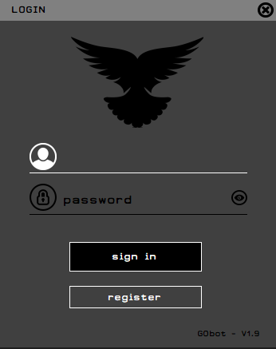
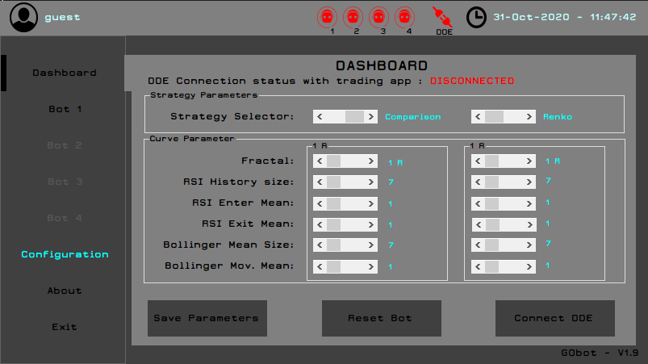

<p align="center"></p>

<p align="center"><h1> GObot Trader Robot - PERSONAL PROJECT </h1></p>

#######################################################################

**Section 1: Project**

This project was done during the three months summer break of 2020. 
It is a trading robot created to operate on the future market. 
The project was developed using concepts and patterns learned from the Object Oriented Programming course,
in c#. Additionally, .Net 4.8 and libraries were used, alongside with multi-threading operations. 
It was also necessary to use a remote database to handle some aspects consumed by the app. Other 
than that, due to some limitations, it was found the need to implement a windows' inter-process 
communication protocol, known as DDE (Dynamic Data Exchange) in order to exchange information 
between applications.

Progress: 1) First version deployed to be used by market strategy experts.

OBS: the bot was originally designed to work with a software that limits the interface with external applications.
Therefore, it was necessary to find a solution to convey with client's requirements. Thus, I saw a
solution using a protocol supported by the trading software and using key bindings to send trade 
orders.

**Section 2: Asymptotic Analysis - Scalability**

Refering to the mathematical bounds of the application's functions run-time / performance. 
Functions defined in the scope of the application are in general linear *O(n)* or constant *O(1)*. Even considering scalability 
of the application it is noted the maintenance of said time complexity. 

**Section 3: Readability**

As the project is a prototype which is in beta version the code still needs to comply standards (ie SOLID principles). 
Though, it is still *not predicted* the refactoring on the near future as my goal is to focus and finish my course.
      
**Section 4: Manual**

      4.1 - Application Manual:

<p align="center"></p>

To login you will use a default username and password, however you can change then in the source 
code of the class Pombos.cs. Or, create a data base to store those information and access it through 
the Pombos.cs class, created to manage those access and some other aspects. 
- default username: guest
- default password: guest 

<p align="center"></p>


      4.2 - SourceCode Manual:
      
The following are few source codes which need to be changed when you implement your strategy. Those lines where
deliberately removed / commented.

[1 - Code that needs to be changed](https://github.com/philipe-go/GObot-TraderRobot/blob/master/RobotLibrary/Pombos.cs#L30-L42)

[2 - Code that needs to be changed](https://github.com/philipe-go/GObot-TraderRobot/blob/master/Login.cs#L102-L122)

[3 - Code that needs to be changed](https://github.com/philipe-go/GObot-TraderRobot/blob/master/RobotLibrary/Strategy.cs#L418)


```c#
//***UNCOMMENT here when inserting the database link on the class Pombos ***//
//***DELETE HERE when inserting the database link on the class Pombos ***//
/*Insert you Strategy logic here*/
/*Insert your remote database login and credentials here -> */
```

#######################################################################

## External Resource ##

[Ndde](https://www.codeplex.com/)

